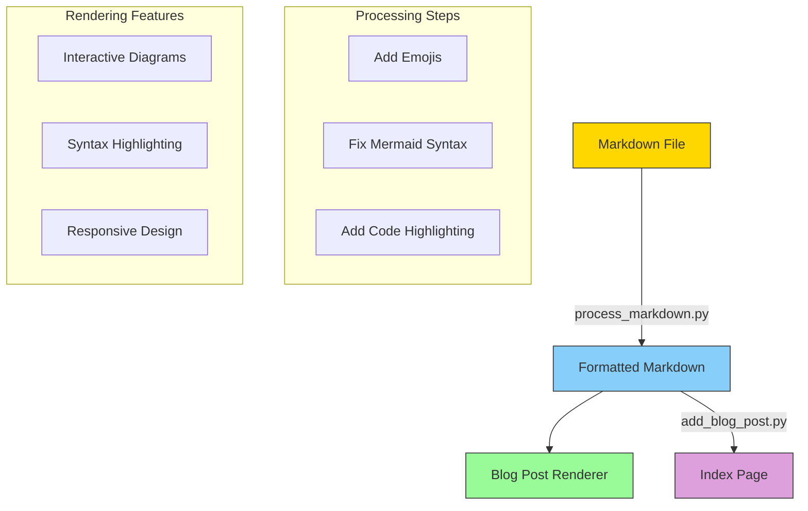
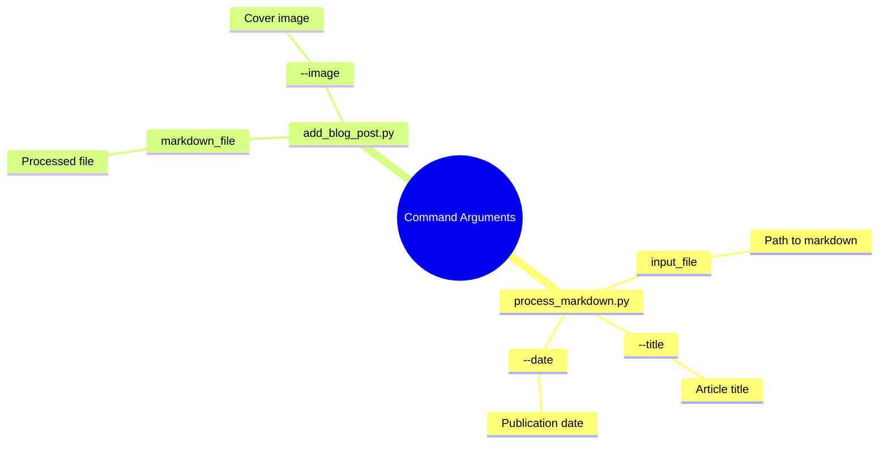
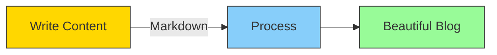

# 🗺️ Markdown to Beautiful Blog: A Complete Guide 🎨

## 🌟 Introduction 🌟

This guide will walk you through transforming your markdown articles into beautifully rendered blog posts with interactive diagrams, syntax-highlighted code, and professional styling. Our markdown processing system handles everything from emoji additions to Mermaid diagram rendering.

## 📖 System Overview 🏗️



## ⚙️ Installation & Setup ⚙️

1. First, ensure you have Python installed on your system
2. Navigate to the markdown_format directory
3. Install required packages:

```bash
cd markdown_format
pip install -r requirements.txt
```

## 🛠️ Usage Guide 📚

### 🛠️ Basic Usage

```python
# 📌 Process a markdown file
python process_markdown.py my_article.md --title "My Amazing Article"

# 📌 Add to blog
python add_blog_post.py assets/blog_posts/my_article.md --image assets/my_image.jpg
```

### 📌 Command Line Arguments 🎮



## ✨ Markdown Features ✨

### 📌 Code Blocks with Syntax Highlighting

```python
def example_function():
    """This code block will be automatically highlighted"""
    message = "Hello, World!"
    print(f"Your message: {message}")
    return message
```

### 📌 Interactive Diagrams

Create beautiful diagrams using Mermaid syntax:



### Automatic Emoji Enhancement 🎯

The processor automatically adds relevant emojis to your headings:
- Introduction → 🌟
- Implementation → 💻
- Guide → 🗺️
- Example → 🎮
- And many more!

## Best Practices 📝

1. **File Organization**
   - Keep images in `assets/blog_images/`
   - Store markdown files in `assets/blog_posts/`
   - Use descriptive filenames

2. **Markdown Structure**
   ```markdown
   # Main Title
   
   ## Section Heading
   
   Content here...
   
   ### Subsection
   
   More content...
   ```

3. **Image Guidelines**
   - Use relative paths
   - Optimize images before adding
   - Include alt text

## Advanced Features 🚀

### 📌 Custom Styling

Your blog posts will automatically receive beautiful styling:

```css
.blog-post-content {
    max-width: 900px;
    margin: 100px auto;
    padding: 3rem;
    background: white;
    box-shadow: 0 4px 20px rgba(0, 65, 116, 0.15);
}
```

### 📌 Mermaid Diagram Types

1. **Flowcharts**
   ```mermaid
   graph TD
       A[Start] --> B{Decision}
       B -->|Yes| C[Action]
       B -->|No| D[Other Action]
   ```

2. **Mindmaps**
   ```mermaid
   mindmap
       root((Main Topic))
           Subtopic 1
               Detail A
               Detail B
           Subtopic 2
               Detail C
   ```

### 📌 Troubleshooting 🔧

Common issues and solutions:

| Issue | Solution |
|-------|----------|
| Emojis not showing | Ensure UTF-8 encoding |
| Diagrams not rendering | Check Mermaid syntax |
| Code not highlighting | Specify language |
| Images not loading | Verify file paths |

## Example Workflow 🎯

1. **Create Your Content**
   ```bash
   # Create new markdown file
   touch my_new_post.md
   ```

2. **Process the File**
   ```bash
   python process_markdown.py my_new_post.md --title "My New Post"
   ```

3. **Add to Blog**
   ```bash
   python add_blog_post.py assets/blog_posts/my_new_post.md
   ```

## 🎬 Conclusion 🎬

This markdown processing system transforms your content into professionally styled blog posts with minimal effort. Focus on writing great content, and let the system handle the presentation!

Remember:
- Write your content in markdown
- Process it using our tools
- Enjoy beautiful, interactive blog posts

Happy blogging! ✍️