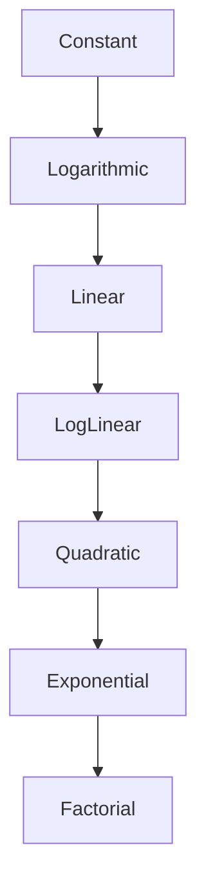

# 🚀 Demystifying Big O Notation: A Journey Through Algorithmic Efficiency 🧮

## Introduction: The Language of Algorithmic Performance 📊

In the vast universe of computer science, Big O notation is our trusty compass, guiding us through the complex landscape of algorithm efficiency. Think of it as a universal translator that helps developers speak the same language when discussing how algorithms perform as data sizes grow. 

### What is Big O Notation? 🤔

Big O notation is a mathematical way to describe the performance or complexity of an algorithm. It specifically describes the worst-case scenario, and how the runtime or space requirements of an algorithm grow as the input size increases.

## The Big O Complexity Spectrum 🌈

Let's visualize the complexity of different algorithmic approaches:



### Let's Break Down Each Complexity Level 🔍

#### 1. O(1) - Constant Time ⚡
The holy grail of algorithmic efficiency! Regardless of input size, these algorithms always take the same amount of time.

```python
def get_first_element(arr):
    """Accessing the first element is always O(1)"""
    if arr:
        return arr[0]  # Takes same time whether array has 10 or 10,000 elements
    return None
```

#### 2. O(log n) - Logarithmic Time 🌲
These algorithms typically divide the problem in half with each step. Binary search is a classic example.

```python
def binary_search(sorted_arr, target):
    """Binary search has logarithmic time complexity"""
    left, right = 0, len(sorted_arr) - 1
    
    while left <= right:
        mid = (left + right) // 2
        
        if sorted_arr[mid] == target:
            return mid  # Found the target
        elif sorted_arr[mid] < target:
            left = mid + 1  # Search right half
        else:
            right = mid - 1  # Search left half
    
    return -1  # Target not found
```

#### 3. O(n) - Linear Time 📈
The runtime grows linearly with the input size. Simple iterations fall into this category.

```python
def find_max_element(arr):
    """Finding max element requires checking each element once"""
    max_val = arr[0]
    for num in arr:
        if num > max_val:
            max_val = num
    return max_val
```

#### 4. O(n log n) - Log-Linear Time ⚙️
Common in efficient sorting algorithms like merge sort and quicksort.

```python
def merge_sort(arr):
    """Merge sort is a classic O(n log n) algorithm"""
    if len(arr) <= 1:
        return arr
    
    # Divide
    mid = len(arr) // 2
    left = merge_sort(arr[:mid])
    right = merge_sort(arr[mid:])
    
    # Conquer (merge)
    return merge(left, right)

def merge(left, right):
    """Merging two sorted arrays"""
    result = []
    i, j = 0, 0
    
    while i < len(left) and j < len(right):
        if left[i] < right[j]:
            result.append(left[i])
            i += 1
        else:
            result.append(right[j])
            j += 1
    
    result.extend(left[i:])
    result.extend(right[j:])
    return result
```

#### 5. O(n²) - Quadratic Time 🔲
Nested loops often indicate quadratic complexity. Think bubble sort or checking all pairs in an array.

```python
def bubble_sort(arr):
    """Bubble sort demonstrates quadratic time complexity"""
    n = len(arr)
    for i in range(n):
        # Each iteration places one element in its correct position
        for j in range(0, n - i - 1):
            if arr[j] > arr[j + 1]:
                # Swap elements
                arr[j], arr[j + 1] = arr[j + 1], arr[j]
    return arr
```

#### 6. O(2ⁿ) - Exponential Time 🌋
Recursive algorithms solving problems like calculating Fibonacci numbers can quickly become inefficient.

```python
def fibonacci_recursive(n):
    """Naive recursive Fibonacci - exponential time complexity"""
    if n <= 1:
        return n
    return fibonacci_recursive(n-1) + fibonacci_recursive(n-2)
```

#### 7. O(n!) - Factorial Time 💥
The most computationally expensive category. Solving the Traveling Salesman Problem using brute force is a classic example.

## Pro Tips for Optimization 🛠️

1. Always consider time and space complexity when designing algorithms.
2. Prefer logarithmic and linear time solutions when possible.
3. Use built-in sorting and searching methods in your programming language.
4. Profile your code to understand its real-world performance.

## Conclusion: Your Algorithmic Compass 🧭

Big O notation isn't just a theoretical concept—it's a practical tool for writing efficient, scalable code. By understanding these complexity levels, you'll make smarter decisions about algorithm design and implementation.

### Keep Exploring! 🚀

Remember, the journey of understanding algorithms is continuous. Keep practicing, keep learning, and most importantly, keep coding! 💻✨

**Pro Tip**: Always measure and profile your actual code. Theoretical complexity is a guide, but real-world performance can vary!