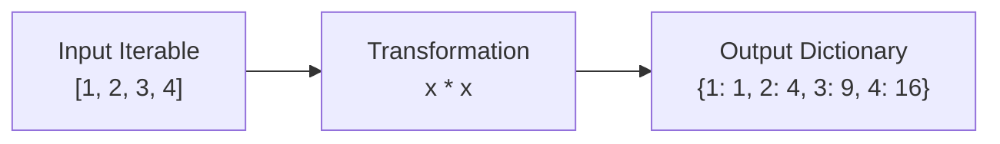

# 🔑 Dictionary Comprehensions: Pythonic Power 🐍

## 🌟 Introduction to Dictionary Comprehensions

Imagine creating dictionaries with the elegance of a poet and the efficiency of a computer scientist. Dictionary comprehensions are Python's concise way of transforming and creating dictionaries in a single, readable line of code.

### 🖼️ Visual Representation of Dictionary Comprehension



## 🎨 Basic Syntax

The basic syntax for dictionary comprehension is:

```python
{key_expr: value_expr for item in iterable}
```

### 🌈 Simple Example

```python
# Creating a dictionary of squares
squares = {x: x*x for x in range(5)}
print(squares)  # Output: {0: 0, 1: 1, 2: 4, 3: 9, 4: 16}
```

## 🔄 Common Use Cases

### 1️⃣ Converting Units

```python
# Converting temperatures from Celsius to Fahrenheit
celsius = {0, 10, 20, 30, 40}
fahrenheit = {c: (c * 9/5) + 32 for c in celsius}
print(fahrenheit)  # Output: {0: 32.0, 10: 50.0, 20: 68.0, 30: 86.0, 40: 104.0}
```

### 2️⃣ Filtering Items

```python
# Creating a dictionary of even squares
even_squares = {x: x*x for x in range(10) if x % 2 == 0}
print(even_squares)  # Output: {0: 0, 2: 4, 4: 16, 6: 36, 8: 64}
```

### 3️⃣ Transforming Keys and Values

```python
# Converting string keys to uppercase
names = {'apple': 1, 'banana': 2, 'cherry': 3}
upper_names = {k.upper(): v for k, v in names.items()}
print(upper_names)  # Output: {'APPLE': 1, 'BANANA': 2, 'CHERRY': 3}
```

## 🎯 Real-World Applications

### 📊 Word Frequency Counter

```python
def word_frequency_analyzer(text):
    words = text.lower().split()
    return {word: words.count(word) for word in set(words)}

text = "The quick brown fox jumps over the lazy dog"
print(word_frequency_analyzer(text))
# {'the': 2, 'quick': 1, 'brown': 1, 'fox': 1, 'jumps': 1, 'over': 1, 'lazy': 1, 'dog': 1}
```

## 🎯 Practice Exercises

1. Create a dictionary mapping numbers to their cubes for numbers 1-5
2. Convert a list of temperatures from Fahrenheit to Celsius
3. Create a dictionary of word lengths from a sentence
4. Filter a dictionary to include only items with values greater than 10

## 🎓 Best Practices

1. Keep comprehensions simple and readable
2. Use meaningful variable names
3. Consider using regular for loops for complex operations
4. Add comments for clarity when needed

## 🚀 Advanced Techniques

### Nested Dictionary Comprehension

```python
matrix = {i: {j: i*j for j in range(3)} for i in range(3)}
print(matrix)
# Output: {0: {0: 0, 1: 0, 2: 0}, 1: {0: 0, 1: 1, 2: 2}, 2: {0: 0, 1: 2, 2: 4}}
```

## 🎭 Common Pitfalls

1. Making comprehensions too complex
2. Forgetting about memory implications with large datasets
3. Not considering readability
4. Overusing comprehensions when simple loops would be clearer

## 🎉 Conclusion

Dictionary comprehensions are a powerful feature in Python that can make your code more elegant and efficient. Practice using them in your projects, but remember to prioritize readability and maintainability.
