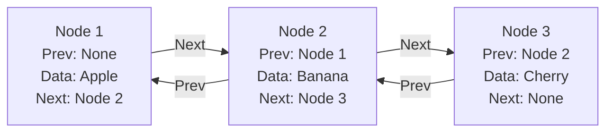

# 🔗 Doubly Linked Lists: A Deep Dive 🐍

## 🌟 Introduction to Doubly Linked Lists

Imagine a two-way street where you can travel forward and backward with equal ease. In the realm of data structures, a doubly linked list is exactly that—a dynamic, flexible chain of nodes that can be traversed in both directions.

### 🖼️ Visual Structure of a Doubly Linked List



## 🎨 Implementation in Python

### Node Class

```python
class Node:
    def __init__(self, data):
        self.data = data
        self.prev = None
        self.next = None
```

### Doubly Linked List Class

```python
class DoublyLinkedList:
    def __init__(self):
        self.head = None
        self.tail = None
```

## 🔄 Basic Operations

### 1️⃣ Insertion at Beginning

```python
def insert_at_beginning(self, data):
    new_node = Node(data)
    if not self.head:
        self.head = new_node
        self.tail = new_node
    else:
        new_node.next = self.head
        self.head.prev = new_node
        self.head = new_node
```

### 2️⃣ Insertion at End

```python
def insert_at_end(self, data):
    new_node = Node(data)
    if not self.head:
        self.head = new_node
        self.tail = new_node
    else:
        new_node.prev = self.tail
        self.tail.next = new_node
        self.tail = new_node
```

### 3️⃣ Deletion

```python
def delete_node(self, key):
    current = self.head
    while current:
        if current.data == key:
            # If node to delete is head
            if current == self.head:
                self.head = current.next
                if self.head:
                    self.head.prev = None
            # If node to delete is tail
            elif current == self.tail:
                self.tail = current.prev
                self.tail.next = None
            # If node to delete is in middle
            else:
                current.prev.next = current.next
                current.next.prev = current.prev
            return
        current = current.next
```

## 🎯 Advanced Operations

### 1️⃣ Reverse Traversal

```python
def reverse_traverse(self):
    current = self.tail
    while current:
        print(current.data, end=" -> ")
        current = current.prev
    print("None")
```

### 2️⃣ List Reversal

```python
def reverse(self):
    current = self.head
    while current:
        # Swap next and prev pointers
        current.next, current.prev = current.prev, current.next
        # Move to the next node
        current = current.prev
    # Swap head and tail
    self.head, self.tail = self.tail, self.head
```

## 🎭 Time Complexity Analysis

| Operation | Time Complexity |
|-----------|----------------|
| Insertion at beginning | O(1) |
| Insertion at end | O(1) |
| Deletion | O(n) |
| Search | O(n) |
| Reverse | O(n) |

## 🎯 Practical Applications

1. Browser's forward and backward navigation
2. Undo/Redo operations in text editors
3. Music player's next/previous functionality
4. Image viewer's navigation
5. Task scheduler with priority queue

## 🚀 Advanced Use Cases

### Implementation of a Deque (Double-ended queue)

```python
class Deque(DoublyLinkedList):
    def add_front(self, data):
        self.insert_at_beginning(data)
        
    def add_rear(self, data):
        self.insert_at_end(data)
        
    def remove_front(self):
        if not self.head:
            return None
        data = self.head.data
        self.head = self.head.next
        if self.head:
            self.head.prev = None
        return data
        
    def remove_rear(self):
        if not self.tail:
            return None
        data = self.tail.data
        self.tail = self.tail.prev
        if self.tail:
            self.tail.next = None
        return data
```

## 🎓 Best Practices

1. Always maintain both head and tail pointers
2. Handle edge cases (empty list, single node)
3. Update prev and next pointers consistently
4. Consider memory management in large lists
5. Use proper error handling

## 🎭 Common Pitfalls

1. Forgetting to update prev pointers
2. Not handling edge cases
3. Memory leaks in circular references
4. Incorrect tail management
5. Inconsistent pointer updates

## 🎉 Conclusion

Doubly linked lists offer powerful bidirectional traversal capabilities, making them ideal for applications requiring backward navigation or undo operations. While they consume more memory than singly linked lists, their flexibility often outweighs this cost in practical applications.
