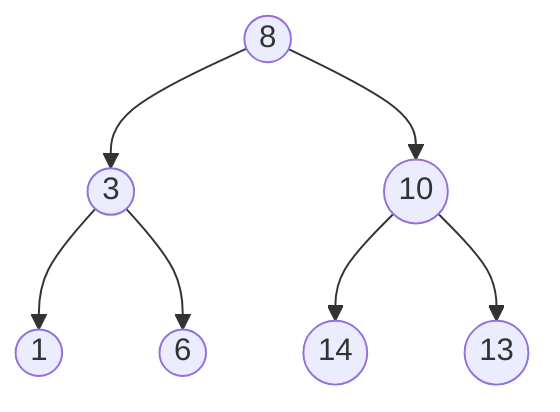

# 🌳 Understanding Tree Data Structures: A Comprehensive Guide 🚀

## 🌟 Introduction to Trees

Trees are hierarchical data structures that consist of nodes connected by edges. Unlike linear data structures like arrays and linked lists, trees are perfect for representing hierarchical relationships in data.

### 🖼️ Visual Representation of a Binary Tree



## 🎨 Basic Implementation

### Node Class

```python
class Node:
    def __init__(self, value):
        self.value = value
        self.left = None
        self.right = None
```

### Binary Tree Class

```python
class BinaryTree:
    def __init__(self):
        self.root = None
```

## 🔄 Tree Traversal Methods

### 1️⃣ In-order Traversal (Left, Root, Right)

```python
def inorder_traversal(self, node):
    if node:
        self.inorder_traversal(node.left)
        print(node.value, end=" ")
        self.inorder_traversal(node.right)
```

### 2️⃣ Pre-order Traversal (Root, Left, Right)

```python
def preorder_traversal(self, node):
    if node:
        print(node.value, end=" ")
        self.preorder_traversal(node.left)
        self.preorder_traversal(node.right)
```

### 3️⃣ Post-order Traversal (Left, Right, Root)

```python
def postorder_traversal(self, node):
    if node:
        self.postorder_traversal(node.left)
        self.postorder_traversal(node.right)
        print(node.value, end=" ")
```

## 🎯 Binary Search Tree Operations

### Insertion

```python
def insert(self, value):
    if not self.root:
        self.root = Node(value)
        return
    
    def _insert_recursive(node, value):
        if value < node.value:
            if node.left is None:
                node.left = Node(value)
            else:
                _insert_recursive(node.left, value)
        else:
            if node.right is None:
                node.right = Node(value)
            else:
                _insert_recursive(node.right, value)
    
    _insert_recursive(self.root, value)
```

### Search

```python
def search(self, value):
    def _search_recursive(node, value):
        if node is None or node.value == value:
            return node
        
        if value < node.value:
            return _search_recursive(node.left, value)
        return _search_recursive(node.right, value)
    
    return _search_recursive(self.root, value)
```

### Deletion

```python
def delete(self, value):
    def _find_min(node):
        current = node
        while current.left:
            current = current.left
        return current

    def _delete_recursive(node, value):
        if node is None:
            return node

        if value < node.value:
            node.left = _delete_recursive(node.left, value)
        elif value > node.value:
            node.right = _delete_recursive(node.right, value)
        else:
            # Node with only one child or no child
            if node.left is None:
                return node.right
            elif node.right is None:
                return node.left
            
            # Node with two children
            temp = _find_min(node.right)
            node.value = temp.value
            node.right = _delete_recursive(node.right, temp.value)
        
        return node

    self.root = _delete_recursive(self.root, value)
```

## 🎯 Advanced Tree Types

### 1️⃣ AVL Tree

```python
class AVLNode(Node):
    def __init__(self, value):
        super().__init__(value)
        self.height = 1

class AVLTree(BinaryTree):
    def _height(self, node):
        if not node:
            return 0
        return node.height
    
    def _balance_factor(self, node):
        if not node:
            return 0
        return self._height(node.left) - self._height(node.right)
    
    def _rotate_right(self, y):
        x = y.left
        T2 = x.right
        
        x.right = y
        y.left = T2
        
        y.height = max(self._height(y.left), self._height(y.right)) + 1
        x.height = max(self._height(x.left), self._height(x.right)) + 1
        
        return x
```

### 2️⃣ Red-Black Tree Properties

```python
class RBNode(Node):
    def __init__(self, value):
        super().__init__(value)
        self.color = "RED"
        self.parent = None
```

## 🚀 Tree Applications

### 1️⃣ File System

```python
class FileSystemNode:
    def __init__(self, name, is_directory=False):
        self.name = name
        self.is_directory = is_directory
        self.children = []
        self.content = "" if not is_directory else None
    
    def add_child(self, child):
        if self.is_directory:
            self.children.append(child)
```

### 2️⃣ Expression Tree

```python
class ExpressionTree:
    def __init__(self, expression):
        self.expression = expression
        self.root = self._build_tree()
    
    def evaluate(self):
        def _eval(node):
            if node.value.isdigit():
                return float(node.value)
            
            left = _eval(node.left)
            right = _eval(node.right)
            
            if node.value == '+': return left + right
            if node.value == '-': return left - right
            if node.value == '*': return left * right
            if node.value == '/': return left / right
        
        return _eval(self.root)
```

## 🎓 Best Practices

1. Choose the right tree type for your needs
2. Keep the tree balanced when possible
3. Use recursion carefully
4. Consider iterative solutions for better space complexity
5. Implement proper error handling

## 🎭 Common Pitfalls

1. Not handling empty trees
2. Forgetting to update parent references
3. Incorrect balance maintenance
4. Memory leaks in node deletion
5. Stack overflow in deep recursion

## 🚀 Performance Comparison

| Operation | BST (avg) | BST (worst) | AVL | Red-Black |
|-----------|-----------|-------------|-----|-----------|
| Search    | O(log n)  | O(n)        | O(log n) | O(log n)  |
| Insert    | O(log n)  | O(n)        | O(log n) | O(log n)  |
| Delete    | O(log n)  | O(n)        | O(log n) | O(log n)  |

## 🎯 Practice Problems

1. Implement level-order traversal
2. Find the height of a binary tree
3. Check if a binary tree is balanced
4. Convert a BST to a sorted linked list
5. Find the lowest common ancestor of two nodes

## 🎉 Conclusion

Trees are fundamental data structures that power many real-world applications. Understanding their properties, operations, and variations is crucial for any software developer. Keep practicing with different tree implementations and explore their various applications in solving complex problems.
